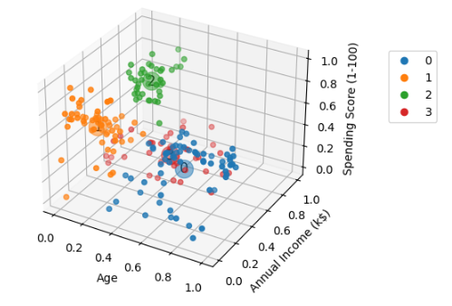

[](https://www.linkedin.com/in/getfelipe/)  
[](https://www.python.org/downloads/release/python-3120/)


# Customer Clustering of a Supermarket

A supermarket has a dataset containing the following features: **"Age," "Gender," "Annual Income (k$)," "Spending Score (1-100),"** and **"CustomerID."** The goal of this project is to identify relationships within the data and create customer clusters. These clusters can help align marketing strategies tailored to each customer profile.

## How?

- Using the **K-Means** algorithm along with a **Pipeline** that includes a **ColumnTransformer** (such as **MinMaxScaler**) to normalize the data.
- Identifying the **elbow point**, a metric used to determine the optimal number of clusters for the model based on the dataset.
- Plotting various visualizations, including:
  - A **boxplot** to interpret the distribution of features.
  - A **3D graph** to visualize clustering results, where **PCA techniques** are applied to reduce dataset dimensionality.

### Example of Clustering Visualization



### Dataset Source

The dataset used in this project can be found at:  
[Customer Segmentation Dataset on Kaggle](https://www.kaggle.com/vjchoudhary7/customer-segmentation-tutorial-in-python)

## Packages Used

The following Python libraries were used in this project:

- `sklearn`
- `pandas`
- `seaborn`
- `matplotlib`

## Repository Structure

```
|---> data     (Dataset used in the project)  
|---> assets   (Images displayed in the README)  
|---> codes    (Scripts containing the project's logic)  
|---> reports  (Initial report with dataset insights)
```

## How to Reproduce the Project

### Prerequisites

Ensure you have Python 3.12 installed.

### Clone the Repository

```sh
git clone https://github.com/
```

### Install Dependencies

```sh
pip install -r requirements.txt
```